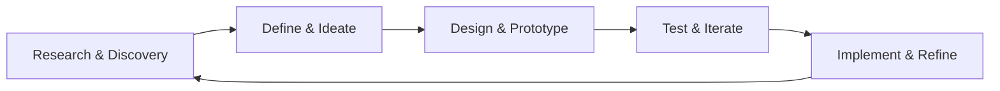

<div align="center">
  <!-- Animated character playing across the screen -->
  

  # 👋 Hi, I'm **KISHAN YADAV**
  ### 🎨 UI/UX Designer | Design Systems Architect | Full-Stack Developer

  > *"Designing meaningful experiences through user-centered thinking and iterative problem-solving"*

  🌐 **Portfolio:** [Kishanyadav.tech](https://kishanyadav.tech)

  <br>

  <p align="center">
    
    
  </p>
</div>

---

<br>

## 🎯 Design Philosophy

I believe in **user-centered design** — placing people at the heart of every design decision. My approach combines:

- 🔍 **Research-Driven Design** – Understanding user needs through data, not assumptions
- 🎨 **Iterative Refinement** – Starting small and iterating wildly to build better experiences
- ♿ **Inclusive Design** – Accessible design is good design; everything should be legible and usable by everyone
- 🔧 **Technical Implementation** – Bridging design and development to create seamless, functional experiences

> *"Do the hard work to make it simple. Making something simple to use is hard — especially when the underlying systems are complex."*

<br>

---

<br>

## 📐 Design Process & Methodology



My design process follows proven UX principles:
- **Empathize** → User research, interviews, contextual inquiry
- **Define** → User personas, journey maps, problem statements
- **Ideate** → Sketching, wireframing, design studios
- **Prototype** → Low to high-fidelity prototypes, interactive mockups
- **Test** → Usability testing, A/B testing, accessibility audits
- **Implement** → Design systems, component libraries, frontend development

<br>

---

<br>

## 🎨 Featured Design Projects

### 💸 **Monivora & Deblify** | *Fintech SaaS & Financial Resolution Platform*
**Role:** Lead Product Designer & Full-Stack Developer  
**Status:** 🚧 *In Development*

**Design Challenge:** Create an intuitive financial management experience that simplifies complex debt resolution workflows for users with varying financial literacy levels.

**Design Solution:**
- Conducted user research to understand pain points in debt management
- Designed progressive disclosure patterns to prevent overwhelming users
- Created a clean, trust-building visual language for sensitive financial data
- Built responsive design system with accessibility at its core

**Tools:** Figma, User Research, Prototyping, Angular, Node.js

---

### 🎓 **[UniQuiz](https://uniquizz-app.netlify.app/)** | *Smart Assessment Platform*
**Role:** UX Designer & Lead Developer  
**Status:** ✅ *Live*

**Design Challenge:** Transform traditional paper-based MCQ assessments into an engaging, scalable digital experience for universities.

**Design Solution:**
- Reduced cognitive load through clean, distraction-free test interfaces
- Designed real-time feedback mechanisms for instant student engagement
- Created admin dashboard prioritizing task efficiency and data visualization
- Implemented responsive design ensuring consistency across devices

**Key Metrics:**
- 40% reduction in assessment administration time
- 95% positive user feedback on interface clarity
- Zero accessibility violations (WCAG 2.1 AA compliant)

**Tools:** Figma, User Testing, Angular, MongoDB

---

### 🔭 **[Leaf Lore](https://kishan-y.github.io/Leaf-Lore/)** | *Modern Admin Dashboard*
**Role:** UI/UX Designer & Frontend Developer  
**Status:** ✅ *Live*

**Design Approach:**
- Glassmorphism UI creating visual hierarchy through depth and transparency
- Structured information architecture for complex workflow management
- Micro-interactions enhancing user feedback and system status visibility
- Dark mode optimization for extended usage comfort

**Design Principles Applied:**
- Recognition over recall (visible navigation patterns)
- Consistency in design patterns and component behavior
- Aesthetic minimalism focusing on essential information

**Tools:** Figma, CSS3, JavaScript, Bootstrap

---

### 📱 **[Mobile Application](https://drive.google.com/drive/folders/1Di7ZDlG10CTdydqNbIapuS_IvCcf2noN?usp=sharing)** | *End-to-End Mobile Experience*
**Role:** Product Designer & Flutter Developer  
**Status:** ✅ *Completed*

**Design Process:**
- User journey mapping from onboarding to core tasks
- Low-fidelity wireframes → High-fidelity prototypes → Developer handoff
- Component-based design system for scalability
- Usability testing with target audience throughout development

**Deliverables:**
- Complete design system documentation
- Interactive prototypes with micro-animations
- Accessibility guidelines and implementation
- Production-ready Flutter application

**Tools:** Figma, Adobe XD, Flutter, Firebase

---

### 🛒 **[Bookshop](https://github.com/KISHAN-Y/bookshop)** | *E-commerce Platform*
**Role:** UX Designer & Full-Stack Developer  
**Status:** ✅ *Completed*

**UX Focus:**
- Optimized checkout flow reducing steps by 50%
- Designed clear error prevention and recovery patterns
- Created responsive product discovery experience
- Implemented user control features (wishlists, filters, sorting)

**Tools:** Figma, Express, MongoDB, Bootstrap

<br>

---

<br>

## 🛠️ Design Tools & Technical Skills

### 🎨 Design & Prototyping
<table align="center" border="0" style="border: none;">
  <tr>
    <td align="center" style="border: none;">
      
    </td>
    <td align="center" style="border: none;">
      
    </td>
    <td align="center" style="border: none;">
      
    </td>
  </tr>
</table>

**Core Competencies:**
- Wireframing & Prototyping (Low to High Fidelity)
- Design Systems & Component Libraries
- User Flow Diagrams & Information Architecture
- Visual Design & UI Animation
- Responsive & Adaptive Design

### 💻 Frontend Development
<table align="center" border="0" style="border: none;">
  <tr>
    <td align="center" style="border: none;">
      
    </td>
    <td align="center" style="border: none;">
      
    </td>
    <td align="center" style="border: none;">
      
    </td>
    <td align="center" style="border: none;">
      
    </td>
    <td align="center" style="border: none;">
      
    </td>
    <td align="center" style="border: none;">
      
    </td>
  </tr>
</table>

### 🔧 Full-Stack (Design Implementation)
<table align="center" border="0" style="border: none;">
  <tr>
    <td align="center" style="border: none;">
      
    </td>
    <td align="center" style="border: none;">
      
    </td>
    <td align="center" style="border: none;">
      
    </td>
    <td align="center" style="border: none;">
      
    </td>
  </tr>
</table>

### 🚀 Deployment & Collaboration
<table align="center" border="0" style="border: none;">
  <tr>
    <td align="center" style="border: none;">
      
    </td>
    <td align="center" style="border: none;">
      
    </td>
    <td align="center" style="border: none;">
      
    </td>
    <td align="center" style="border: none;">
      
    </td>
  </tr>
</table>

<br>

---

<br>

## 📊 Weekly Development Breakdown

<div align="center">

<!--START_SECTION:waka-->
```text
📊 This week I spent my time on

JavaScript   3 hrs 26 mins  ███████████░░░░░░  37.53 %
HTML/CSS     2 hrs 42 mins  ████████░░░░░░░░░  29.45 %
Angular      1 hr 58 mins   ██████░░░░░░░░░░░  21.55 %
Flutter      33 mins        █░░░░░░░░░░░░░░░░  06.17 %
Other        13 mins        ░░░░░░░░░░░░░░░░░  02.53 %
```
<!--END_SECTION:waka-->

</div>

<br>

---

<br>

## 📊 Design Principles I Live By

### Nielsen's Heuristics in Practice:
1. **🔍 Visibility of System Status** – Always keep users informed with timely feedback
2. **🗣️ Match System & Real World** – Speak the user's language, not technical jargon
3. **🎮 User Control & Freedom** – Provide clear escape routes for mistakes
4. **📐 Consistency & Standards** – Follow platform conventions and maintain internal consistency
5. **🛡️ Error Prevention** – Design to prevent problems before they occur
6. **👁️ Recognition Over Recall** – Make options and actions visible
7. **⚡ Flexibility & Efficiency** – Accommodate both novice and expert users
8. **🎯 Aesthetic & Minimalist Design** – Remove unnecessary elements
9. **🆘 Error Recovery** – Provide plain-language error messages with solutions
10. **📚 Help & Documentation** – Design shouldn't need explanation, but provide support when needed

### Design Mantras:
> *"Perfect is the enemy of good."* – Ship iteratively, improve continuously

> *"The details are not the details. They make the design."* – Charles Eames

> *"Design is not just what it looks like. Design is how it works."* – Steve Jobs

<br>

---

<br>

## 📈 GitHub Activity

<div align="center">
  
  
</div>

<br>

<div align="center">
  
</div>

<br>

---

<br>

## 🤝 Let's Connect & Collaborate

I'm always interested in discussing:
- User experience challenges and design solutions
- Collaborative design projects
- Design system architecture
- Accessibility and inclusive design
- Bridging design and development

<div align="center">
  <a href="https://kishanyadav.tech"></a>
  <a href="mailto:Kishanyadav2093@gmail.com"></a>
  <a href="https://www.linkedin.com/in/kishan-y"></a>
  <a href="https://github.com/KISHAN-Y"></a>
</div>

<br>

<div align="center">

### 💡 *"Good design is obvious. Great design is transparent."*


**⭐ Star my repositories if you find them useful!**

**📬 Open to freelance projects and design collaborations**

</div>
